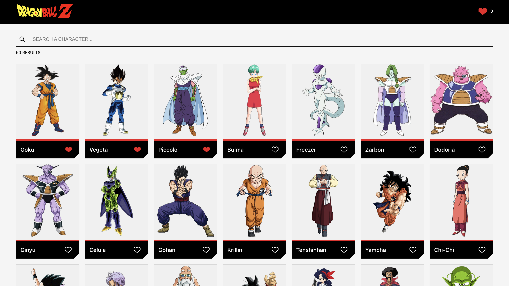
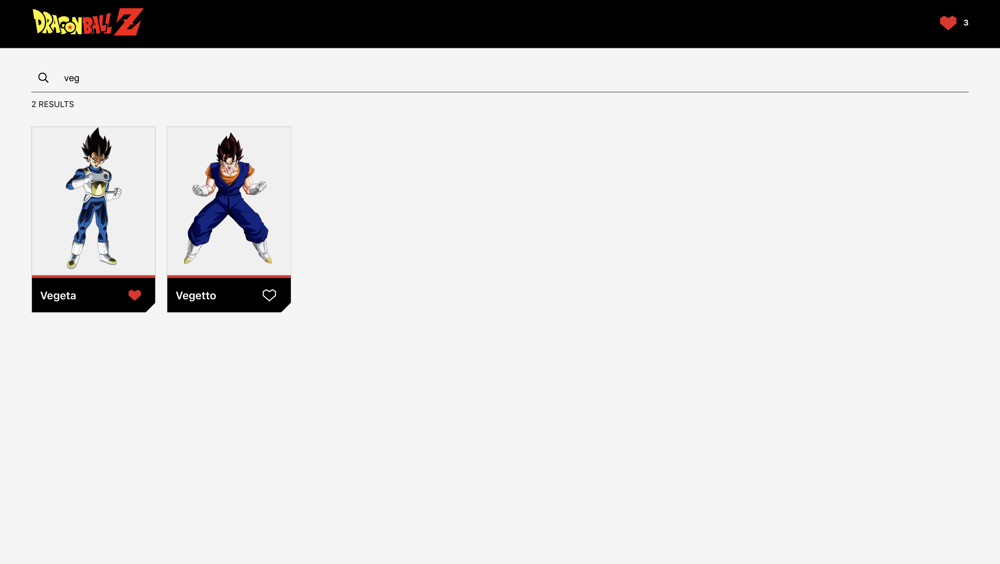
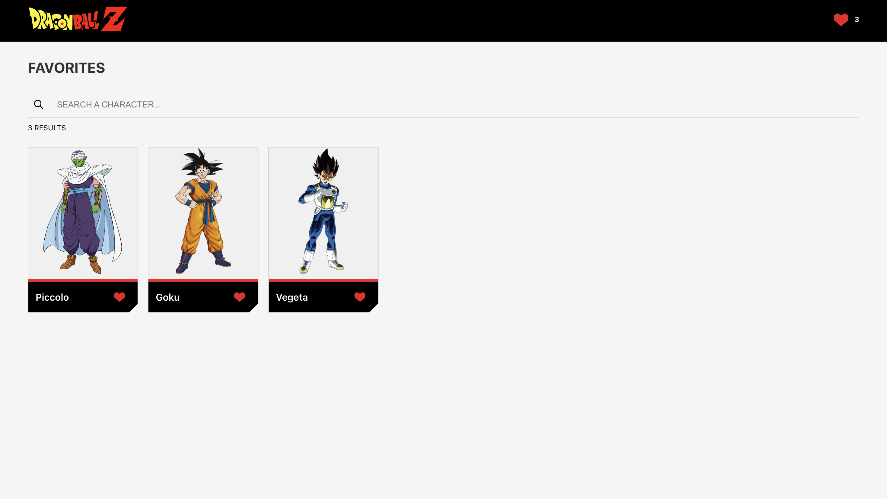
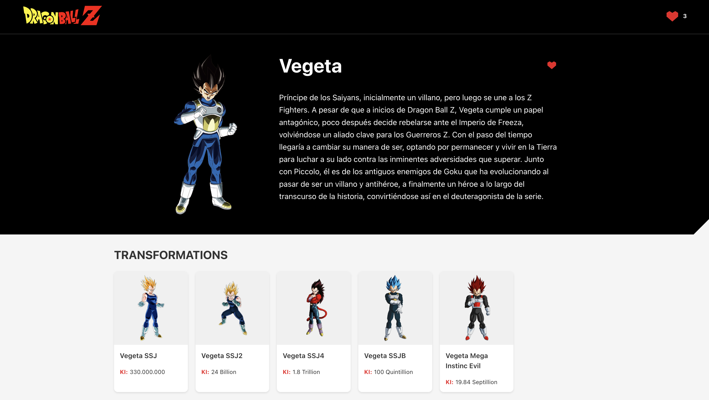
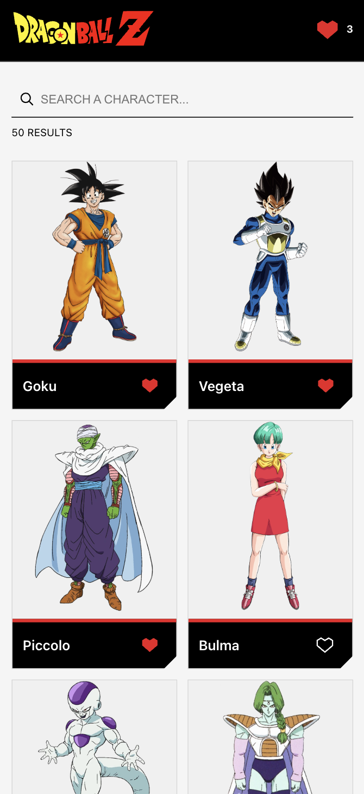
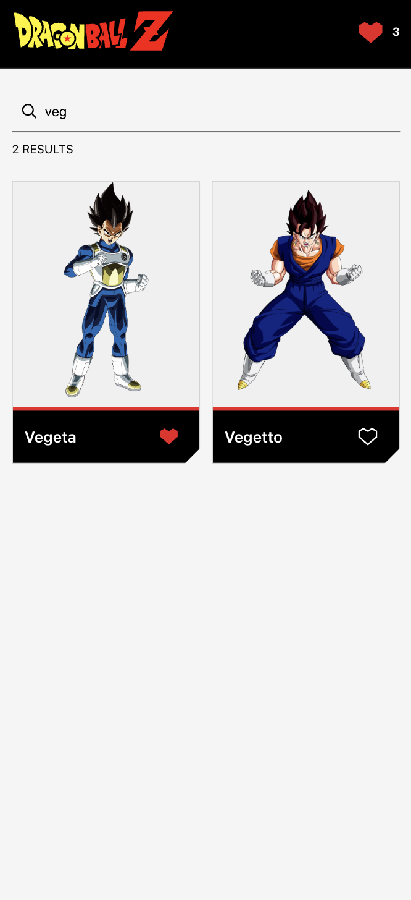
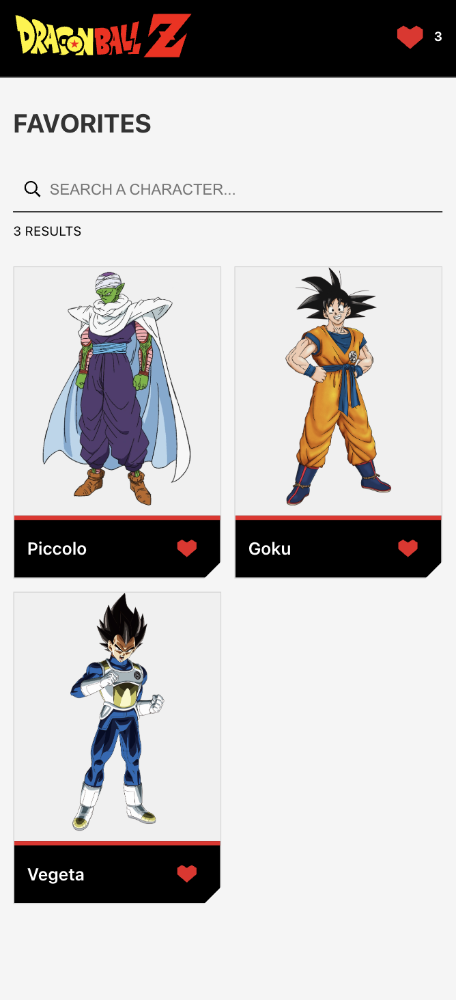
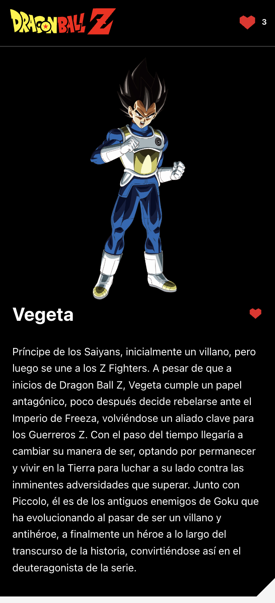
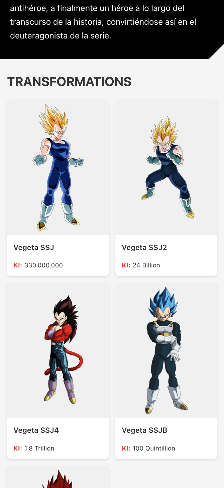

# Dragon Ball Characters App

## Overview

A web application for exploring Dragon Ball characters, featuring search, favorites, and detailed character views.

## Features

- Display a list of characters.
- Search for characters by name.
- Add/remove characters to/from favorites.
- View character details, including transformations.
- Responsive design for both desktop and mobile.

## Prerequisites

- Node.js (v18+)
- npm

## Installation

1. Clone the repository

2. Install dependencies
```bash
cd dragonball-characters-app

npm install
```

3. Run the application
```bash
npm run build

npm run dev
```

4. (optional for the frontend project) Open the app on your phone's browser!

    Run the app the same way as the previous step, in either development or production mode, but by adding *-- --host* at the end. For example, `npm run preview -- --host`.

    You'll find 2 URLs in the console: **Local** and **Network**. Copy the **Network** URL (e.g., *http://192.168.1.100:5173*) in your phone's browser of choice and Voilà, you should see the app running in your phone with responsiveness in all its glory!

    *Note: make sure to have both your PC running the app and your phone connected to the same Wi-Fi network.*

## Screenshots

### Desktop






### Mobile






