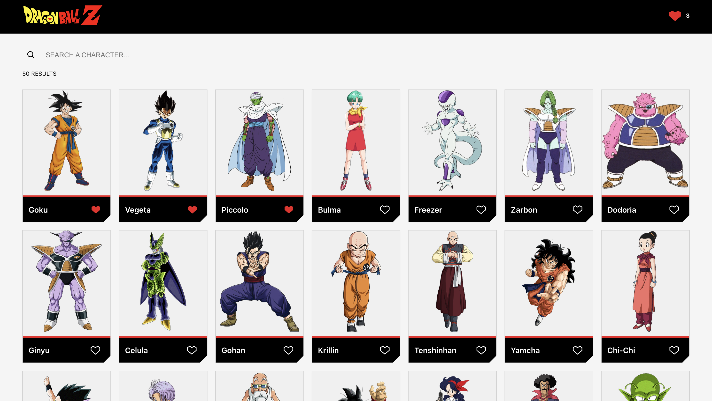
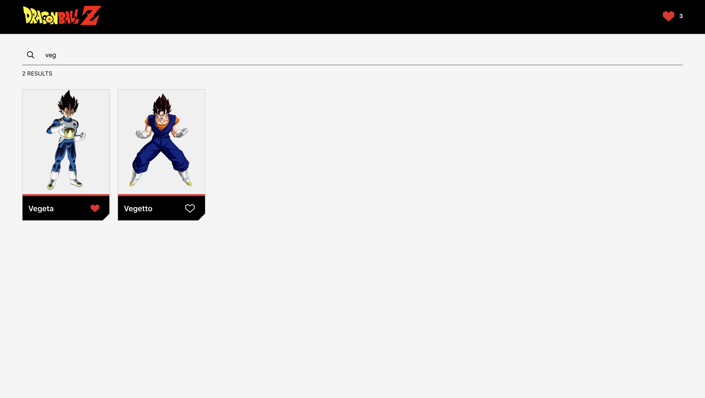
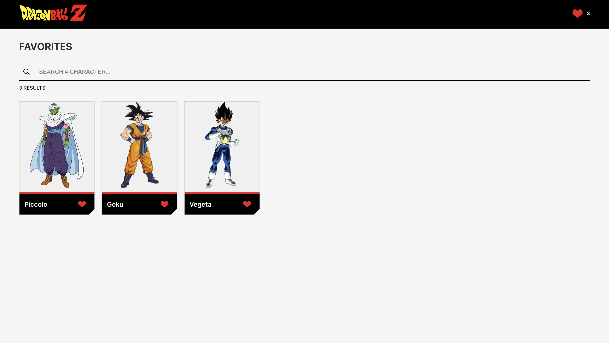
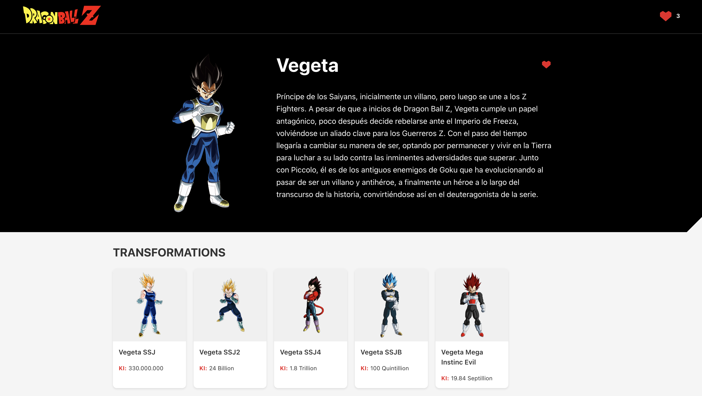
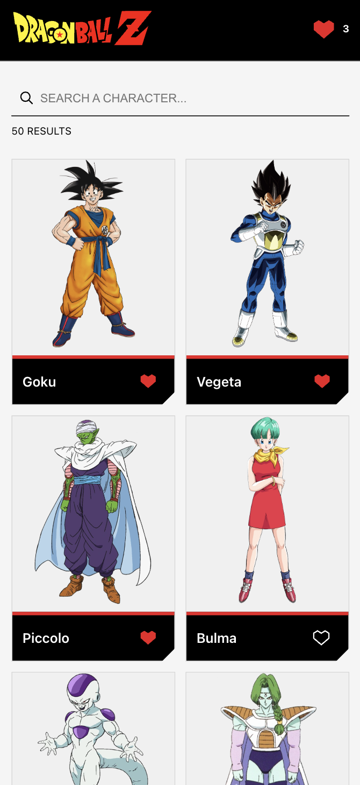
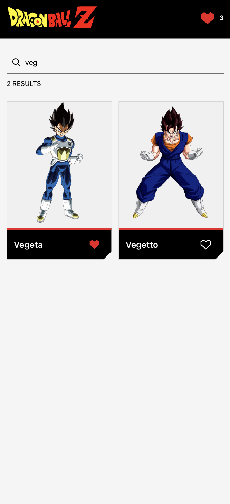
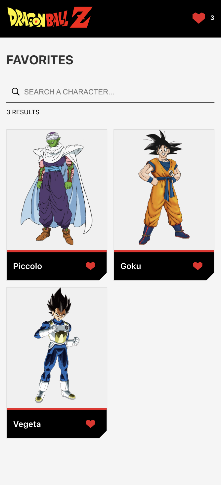
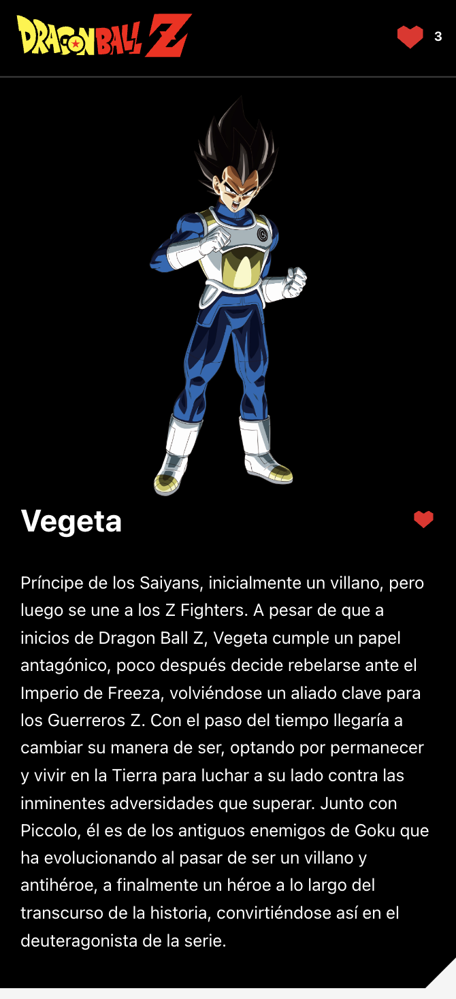
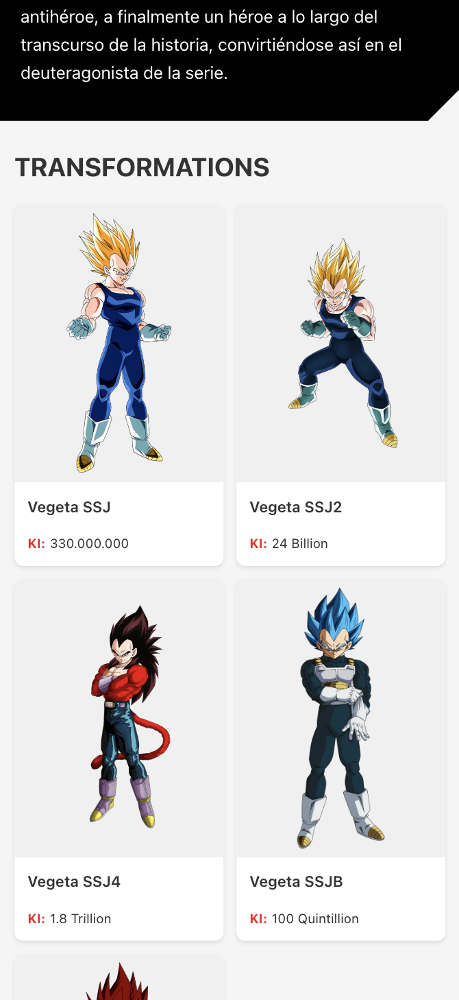

# Dragon Ball Characters App

## Overview

A React-based web application for exploring Dragon Ball characters, featuring search, favorites, and detailed character views.

## Features

- Display a list characters.
- Search for characters by name.
- Add/remove characters to/from favorites.
- View character details, including transformations.
- Responsive design for both desktop and mobile.

## State Management with Zustand

The application uses Zustand for efficient and flexible state management. Key features include:
- Persistent storage using `persist` middleware.
- Immutable state updates with `immer`.
- DevTools integration for debugging.
- Centralized state for:
  - Search functionality.
  - Global state preservation across components.

## Project Structure

```
src/
├── api/            # API interaction logic
├── assets/         # Static assets
├── components/     # Reusable React components
│   ├── features/   # Feature-specific components
│   ├── shared/     # Shared UI components
│   └── ui/         # UI layout components
├── hooks/          # Custom React hooks
├── pages/          # Page components
├── store/          # State management (Zustand)
├── styles/         # Global SCSS values
├── types/          # Data interfaces used across the app
└── utils/          # Utility functions
```

## Component Architecture

The project follows a modular component structure:
- Each component has its own folder containing:
  - Base component file (`.tsx`).
  - Styles file (`.scss`).
  - Test file (`.test.tsx`).
  - `index.ts` for clean exports.

Advantages:
- Improved code organization.
- Easy to locate related files.
- Encapsulation of component-specific logic.
- Simplified imports.
- Easier maintenance and scalability.

## Application Routes

The application supports the following routes:

- `/` (Home)
  - Displays initial list of 50 characters.
  - Supports character search.
  - Allows adding/removing favorites.

- `/favorites`
  - Shows only favorite characters.
  - Supports searching within favorites.
  - Allows adding/removing favorites.

- `/character/:id`
  - Displays detailed information about a specific character.
  - Shows character transformations.
  - Allows adding/removing from favorites.

## Performance Optimizations Implemented

- Memoized components to prevent unnecessary re-renders.
- Efficient state management with Zustand.
- LocalStorage caching.

## Tech Stack

- React 18
- TypeScript
- Zustand (State Management)
- React Router
- Axios (API calls)
- SCSS
- Jest & React Testing Library
- Vite

## Prerequisites

- Node.js (v18+)
- npm

## Installation

1. Clone the repository

2. Install dependencies
```bash
cd dragonball-characters-app

npm install
```

3. Run the application
```bash
# Development mode
npm run dev

# Production mode (minified files)
npm run build
npm run preview

# Extra - "full" mode (runs lint, test, build and preview in order)
npm run full
```

4. (optional) Open the app on your phone's browser!

    Run the app the same way as the previous step, in either development or production mode, but by adding *-- --host* at the end. For example, `npm run preview -- --host`.

    You'll find 2 URLs in the console: **Local** and **Network**. Copy the **Network** URL (e.g., *http://192.168.1.100:5173*) in your phone's browser of choice and Voilà, you should see the app running in your phone with responsiveness in all its glory!

    *Note: make sure to have both your PC running the app and your phone connected to the same Wi-Fi network.*

## Linting

- Run lint: `npm run lint`
- Run lint fix: `npm run lint:fix`

## Testing

- Run all unit tests: `npm run test`
- Run all tests with coverage: `npm run test:coverage`

## Recommendations for Further Improvement

1. Add translations capability. By using **i18n** for example, users could select which language to see the app on. Right now, it's all in English as in the given project instructions designs, but the character's description, which comes directly from the API, comes in Spanish, with no possibility of changing its language in the API call payload whatsoever. In the [documentation](https://web.dragonball-api.com/about) there's a reference to the GitHub repository hosting its code, and there even seems to be an [open issue](https://github.com/intentodepirata/api-dragonball/issues/1) about this.
2. Improve tests coverage.
3. Set up a CI/CD pipeline with Lint and Test checks.

## Screenshots

### Desktop






### Mobile






